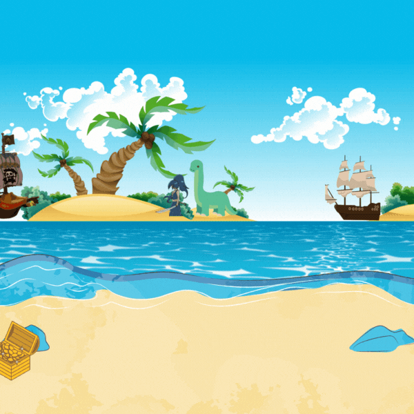

# Coin_Hunter-Game

# Coin Hunter 🏴‍☠️💰

A fun and engaging treasure hunting game built with Python's Turtle graphics library. Guide your pirate hunter across a tropical island to collect falling gold coins and build your treasure!

## 🎮 Game Preview



## 🚀 Features

- **Interactive Gameplay**: Control your pirate hunter with arrow keys
- **Dynamic Scoring System**: Track your treasure collection in real-time
- **Animated Characters**: Directional sprites that change based on movement
- **Endless Gameplay**: Coins continuously fall from the sky
- **Tropical Theme**: Beautiful island background with pirate aesthetics

## 🎯 How to Play

1. **Movement**: 
   - Press `Right Arrow` to move your hunter right
   - Press `Left Arrow` to move your hunter left

2. **Objective**: 
   - Catch falling gold coins before they hit the bottom
   - Each coin collected increases your score by 1

3. **Challenge**: 
   - Coins fall at random positions
   - Move quickly to catch as many as possible!

## 🛠️ Installation & Setup

### Prerequisites
- Python 3.x installed on your system
- Turtle graphics library (comes with Python)

### Required Assets
Make sure you have these image files in your project directory:
- `goldhunt.gif` - Background image (tropical island scene)
- `left.gif` - Left-facing hunter sprite
- `right.gif` - Right-facing hunter sprite  
- `coin.gif` - Gold coin sprite

### Running the Game
1. Clone this repository:
   ```bash
   git clone https://github.com/yourusername/coin-hunter.git
   cd coin-hunter
   ```

2. Run the game:
   ```bash
   python coin_hunter.py
   ```

## 🎨 Game Assets

The game uses custom sprites for an immersive pirate adventure:
- **Background**: Tropical island with palm trees, pirate ship, and ocean
- **Hunter Character**: Pirate with basket, facing left/right based on movement
- **Gold Coin**: Animated treasure coin
- **UI Elements**: Score display in pirate-themed font

## 🔧 Technical Details

### Game Mechanics
- **Screen Size**: 600x600 pixels
- **Hunter Speed**: 5 pixels per move
- **Coin Fall Speed**: 3 pixels per frame
- **Collision Detection**: 50-pixel radius
- **Score Range**: Unlimited

### Code Structure
```
coin_hunter.py
├── Screen Setup & Assets
├── Player Character (Hunter)
├── Score System
├── Coin Mechanics  
├── Movement Controls
├── Game Loop
└── Collision Detection
```

## 🎮 Controls

| Key | Action |
|-----|--------|
| `→` (Right Arrow) | Move hunter right |
| `←` (Left Arrow) | Move hunter left |

## 🏆 Game Features

- **Responsive Controls**: Smooth character movement
- **Real-time Scoring**: Instant score updates
- **Infinite Gameplay**: Coins spawn endlessly
- **Visual Feedback**: Character sprites change direction
- **Challenge Scaling**: Random coin positions increase difficulty

## 🔄 Game Loop

1. Coin falls from top of screen
2. Player moves hunter left/right
3. Collision detection checks if hunter catches coin
4. Score updates and coin respawns at random position
5. Process repeats indefinitely

## 📋 Future Enhancements

Potential improvements for future versions:
- [ ] Multiple coin types with different point values
- [ ] Power-ups and special items
- [ ] Increasing difficulty levels
- [ ] Sound effects and background music
- [ ] High score persistence
- [ ] Multiple hunter characters
- [ ] Obstacles and enemies
- [ ] Time-based challenges

## 🤝 Contributing

1. Fork the repository
2. Create a feature branch (`git checkout -b feature/AmazingFeature`)
3. Commit your changes (`git commit -m 'Add some AmazingFeature'`)
4. Push to the branch (`git push origin feature/AmazingFeature`)
5. Open a Pull Request

## 📝 License

This project is licensed under the MIT License - see the [LICENSE](LICENSE) file for details.

## 👨‍💻 Author

Created with ❤️ by [Your Name]

## 🙏 Acknowledgments

- Python Turtle Graphics for the game framework
- Pirate and treasure themes for visual inspiration
- Open source community for development support

---

**Enjoy your treasure hunting adventure! 🏴‍☠️⚓**
